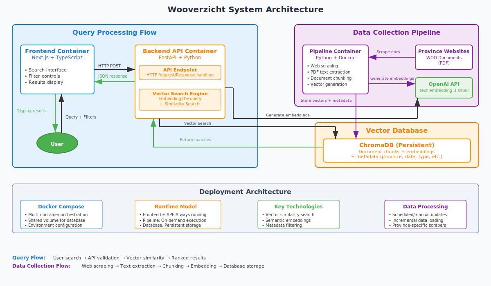
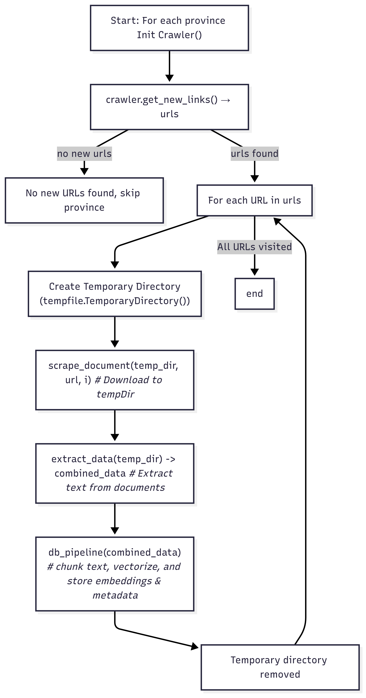

# Wooverzicht: Containerized Document processing and retrieval using vectorization

This project provides a containerized application for finding relevant Woo-documents given a query from the user. The application is split into a backend API, a frontend UI, and a separate pipeline service for data collection, all running in Docker containers. The pipeline service collects Woo-documents from the province sites, vectorises them and puts them in the vector database.

This application has been created to make it easier for Woo-employees to retrieve past Woo-requests. The current search engine is term-based, which means you can only retrieve a Woo-request if you know the exact term that is used in the title of the request. This solution implements vector search based on the contents of documents related to a Woo-requests.

## Quick start

_**Prerequisites: Docker, openAI API key**_

1. Clone the repository
2. Copy `.env.example` to `.env` and fill required fields
3. Run `docker-compose up -d --build`
4. Visit <http://localhost:3000>

## Project Structure

This repository is split into two main directories: `backend/` and `Wooverzicht-frontend/`. The `backend/` folder contains all files relevant to the backend of the application running on the server. `backend/api.py` contains all api functions for the frontend to communicate with the backend. The backend folder also contains all files related to building and updating the database. The main script that handles all logic for updating the vector database can be found at `backend/pipeline.py`. the `backend/data_scraping/` folder containts all relevant scripts for crawling and scraping province websites.
Below, a file tree of the project can be found:

```bash
Project_root
├── Dockerfile.dbcheck                  # Docker container for database health checks, unused at the moment
├── README.md                           # Project documentation
├── backend/                            # Backend services and data processing
│   ├── Dockerfile.api                  # Docker container for FastAPI backend
│   ├── Dockerfile.pipeline             # Docker container for data pipeline
│   ├── URLs.txt                        # List of tracked URLs for crawling
│   ├── api.py                          # FastAPI backend service
│   ├── .env                            # environment file for the backend
│   ├── chromadb_query.py               # ChromaDB vector database query interface
│   ├── config.py                       # Configuration settings and environment variables
│   ├── conversational_rag.py           # RAG (Retrieval Augmented Generation) system
│   ├── createdb.py                     # Database initialization script
│   ├── data_scraping/                  # Province-specific web scraping modules
│   │   ├── flevoland_crawler.py        # OUTDATED: Flevoland province website crawler
│   │   ├── flevoland_scraper.py        # OUTDATED: Flevoland province data scraper
│   │   ├── gelderland_crawler.py       # OUTDATED: Gelderland province website crawler
│   │   ├── gelderland_scraper.py       # OUTDATED: Gelderland province data scraper
│   │   ├── noordbrabant_crawler.py     # OUTDATED: Noord-Brabant province website crawler
│   │   ├── noordbrabant_scraper.py     # OUTDATED: Noord-Brabant province data scraper
│   │   ├── overijssel_crawler.py       # OUTDATED: Overijssel province website crawler
│   │   ├── overijssel_scraper.py       # OUTDATED: Overijssel province data scraper
│   │   ├── zuidholland_crawler.py      # Zuid-Holland province website crawler
│   │   └── zuidholland_scraper.py      # Zuid-Holland province data scraper
│   ├── extract.py                      # Document text extraction and processing
│   ├── failed_downloads.txt            # Log of failed download attempts
│   ├── healthcheck.py                  # System health monitoring
│   ├── manual_pipeline.py              # Manual pipeline execution script to add one specific Woo-verzoek
│   ├── pipeline.py                     # Main data collection and processing pipeline to build/add to DB
│   ├── requirements.api.txt            # Python dependencies for API service
│   ├── requirements.pipeline.txt       # Python dependencies for pipeline service
│   ├── requirements.txt                # General Python dependencies
│   └── start.sh                        # Backend startup script
├── bitbucket-pipelines.yml             # CI/CD pipeline configuration
├── check.py                            # System verification script
├── database/                           # ChromaDB vector database storage
├── docker-compose.yml                  # Multi-container Docker orchestration
├── requirements.txt                    # Root level Python dependencies
└── Wooverzicht-frontend/               # Next.js frontend application
    ├── Dockerfile                      # Frontend container configuration
    ├── README.md                       # Frontend documentation
    ├── eslint.config.mjs               # ESLint code quality configuration
    ├── next.config.js                  # Next.js framework configuration
    ├── next.config.ts                  # TypeScript Next.js configuration
    ├── package-lock.json               # Locked dependency versions
    ├── package.json                    # Node.js dependencies and scripts
    ├── postcss.config.mjs              # PostCSS styling configuration
    ├── public/                         # Static assets and images like logos
    ├── src/                            # Source code
    │   ├── app/                        # Next.js app directory (routing)
    │   ├── components/                 # Reusable UI components
    │   ├── hooks/                      # Custom React hooks
    │   ├── services/                   # API communication layer
    │   ├── theme/                      # UI theming and design tokens
    │   ├── types/                      # TypeScript type definitions
    │   └── utils/                      # Utility functions and constants
    └── tsconfig.json                   # TypeScript compiler configuration
```

---

## Setup Instructions

1. **Prepare the environment file**
   - Copy `.env.example` to `.env` in the backend folder
   - Fill in your OpenAI API key and other configuration settings

2. **Build the vector database if none exists/update the vector database**

   ```bash
   docker-compose up -d --build backend-pipeline
   ```

3. **Build and start the main services**

   ```bash
   docker-compose up -d --build
   ```

4. **Access the application (locally)**
   - Frontend: <http://localhost:3000>
   - Backend API: <http://localhost:8000>

## Environment Configuration

### Mandatory variables

```bash
OPENAI_API_KEY=your_key_here # API key used to call openAI model
CHROMA_DB_PATH=database # Path to the database file
```

### Optional variables

All values below correspond to the default values if the environment variable is left empty

```bash
CHUNK_SIZE=1200 # Size of the chunks the woo-documents will be split into
CHUNK_OVERLAP=50 # Number of charaters overlap between the chunks
COLLECTION_NAME=document_chunks #ChromaDB collection name
EMBEDDING_MODEL=text-embedding-3-small # OpenAI model used for embeddings
MAX_WORKERS=5 # Number of parallel embedding workers
BATCH_SIZE=100 # Batch size for API calls and DB operations
MAX_ZIP_SIZE=2684354560 # max size for downloading woo-request from websites. This value corresponds to 2.5 GB
```

## API Documentation

### POST /api/query/documents

Retrieve relevant documents for a query without generating a response.

Request Body:

```json
json{
  "query": "string",
  "filters": {
    "provinces": ["string"],     // optional
    "startDate": "YYYY-MM-DD",   // required
    "endDate": "YYYY-MM-DD"      // required
  }
}
```

Response:

```json
json{
  "success": true,
  "query": "string",
  "chunks": [...],
  "documents": [...],
  "total_chunks": 0,
  "total_documents": 0
}
```

Base URL: <http://localhost:8000> (development)

CORS: Currently allows all origins (⚠️ update for production)

---

## Architecture Overview

This application is split up in three main components. These components have been chosen to create a minimal viable product. Therefore they might not be optimal for a production environment.

1. **Frontend (Nextjs)**
   - Provides the user interface
   - Communicates with the backend via HTTP/SSE
   - Handles displaying results and sources

2. **Backend API (FastAPI)**
   - Processes queries and generates responses
   - Manages access to the RAG system
   - Handles document retrieval via ChromaDB

3. **Pipeline Service**
   - Runs as a separate container
   - Collects new documents from provincial websites
   - Processes and indexes documents for search
   - Updates the vector database
   - Only runs when explicitly/manually triggered

A summary of this architecture and an overview of the interactions between components is shown in the image below.


### Key Benefits of This Architecture

1. **Complete Separation**: The pipeline container doesn't interfere with the API service. This means you can update the database seperately from the application.
2. **Resource Optimization**: Pipeline resources are only used when needed.
3. **Flexible Scheduling**: Run the pipeline on demand or on a schedule.

## System requirements

### Building database

To build the database, Woo-requests need to be downloaded and vectorized. This is a resource-heavy process. Currently, when scraping a Woo-request, a document is downloaded into memory before being stored in a temporary folder on the server. Therefore you'll only be able to download requests smaller than the available memory of the server. If a request is bigger than the `MAX_ZIP_SIZE` specified as an environment variable, it will be skipped. For our implementation we handle documents up to 2.5 GB.

### Hosting the database

The biggest bottleneck for vector databases is the amount of RAM availibilty. The amount of RAM needed is heaviliy dependent on the type of database used. Here are the requirements specified by [chromaDB](https://cookbook.chromadb.dev/core/resources/#ram):

```
Number of vectors * Dimensionality of vectors * 4 bytes = RAM required
```

- Number of vectors: This is the number of vectors indexed. These are the documents/chunks in your Chroma collection. Using the default settings mentioned in [Optional variables](#optional-variables), all Woo-documents published before 18/08/25 of the province South-Holland are represented as 73998 vectors.
- Dimensionality of vectors: This is the dimensionality of the vectors output by your embedding model. For example, if you use OpenAI's `text-embedding-small-3`, the dimensionality of the vectors is 1536.

```
73998 * 1536 * 4 = 0.42 GB RAM required
```

So 0.42 GB RAM is required to load a vector database of this size in memory. Hosting the web-app and the backend also requires some memory.

The size of this database is 1.26 GB

### Examples

For the Woo-request: [Woo-besluit mogelijke nieuwe wegverbinding tussen de A44 en de N208](https://www.zuid-holland.nl/politiek-bestuur/gedeputeerde-staten/besluiten/besluit/woo-besluit-mogelijke-nieuwe-wegverbinding-tussen-de-a44-en-de-n208) the document [3-2024-04-02-plan-van-aanpak-n208-a44-regionaal-overleg-geredigeerd-pdf.pdf](https://www.zuid-holland.nl/publish/besluitenattachments/woo-besluit-mogelijke-nieuwe-wegverbinding-tussen-de-a44-en-de-n208/3-2024-04-02-plan-van-aanpak-n208-a44-regionaal-overleg-geredigeerd-pdf.pdf)" has 12 pages. This translates to 16 vectors for a chunk size of 1200 characters. The document [Processed 2-2025-04-03-probleemanalyse-bereikbaarheid-verkeersveiligheid-en-leefbaarheid-a.pdf](https://www.zuid-holland.nl/publish/besluitenattachments/woo-besluit-mogelijke-nieuwe-wegverbinding-tussen-de-a44-en-de-n208/2-2025-04-03-probleemanalyse-bereikbaarheid-verkeersveiligheid-en-leefbaarheid-a.pdf) is a 107 pages, which translates to 134 vectors. At the moment only (selectable) text is used to create vectors. Images, for example, are ignored.

## Pipeline service (building the database)

The pipeline script `/backend/pipeline.py` works in several steps to retrieve and vectorize relevant documents:

1. **Import appropriate crawler and scraper for the selected province**
   Dynamically loads the right Crawler and Scraper classes based on the province’s configuration.

2. **Retrieve Woo-documents (one Woo-request at a time) from a province website**
   Uses the Crawler to collect new document URLs from the province’s site.

3. **Scrape each document**
   Downloads and saves the document files to a temporary directory.

4. **Extract structured data from documents**
   Runs the `extract_data` function to process the scraped files and output relevant metadata and text content.

5. **Chunk and store in vector database**
   Passes extracted content to the `db_pipeline` function, which chunks the text and stores embeddings in the database for later retrieval.

6. **Repeat for all found URLs**
   Loops through all URLs found by the crawler and processes them in sequence.

### Diagram of the pipeline script



<!--  -->

## Development

To modify the application:

1. Make changes to the code in the respective directories
2. Rebuild the containers: `docker compose build`
3. If the pipeline script or any scrapers/crawlers are modified: `docker compose build backend-pipeline`

## System Components & Technologies

This is a list of the current technologies used in the application:

1. Embedding model: `text-embedding-3-small`
2. Database: `chromaDB>=0.4.22`

## Limitations

In this section limitations of the current application will be listed.

1. At the moment a local version of chromaDB is used. This is a 'lightweight' database most used for local development and prototyping. The speed of the database/retrieval of relevant vectors is reduced with large amounts of data.
2. This implementation can only handle PDFs with text in them. No OCR is used.
3. This implementation can not handle 'too' large Woo-requests. When scraping a request it is downloaded into memory before being stored on the server. This means you can only download requests as big as the availible memory.
4. Woo-documents are split up into chunks before they are vectorised. This can cause bias because bigger documents can be over-represented in the database. E.g. a document of 1000 characters gets one chunk in the database, but a document of 10.000 characters ten 10 chunks.
   1. Not all data in a Woo-document is relevant for retrieval. So there is also a lot of redundant data in the database.
5. The application only uses vectors to find relevant documents. No term search is used. Embeddings are not good at specific jargon, so it might have more trouble finding very specific documents.
6. Currently the websites of the provinces are scrapes to collect relevant Woo-documents. A direct API endpoint to download Woo-documents into the database would be significantly better and future-proof. If a province changes the way the layout of the website looks, the scraper will stop working.

## Future development

This application has been developed as a prototype to prove that this implementation adds value to a Woo team. Initial tests have shown that this is the case. Continuous testing needs to be done with a Woo team to confirm that this keeps being true.

To bring this application from a prototype to production here are some recommendations:

1. Use a professional vector database that is able to handle large amounts of data.
   - Host database on its own server and acces database using API calls.
2. Combat bias in the vector database by making sure that each document has the same amount of chunks in the database.
3. The script to update the database each day should be rewritten. At the moment it is unable to handle large documents, because it downloads documents into memory.
4. If possible, use a direct API connection to collect Woo-documents.
5. Use OCR to increase possibility of collection relevant data from PDFs.
6. If recall needs to be increased, introduce term search together with vector search.

### Direct API connection

For the province of South Holland, we already checked if it is possible to retrieve documents using a direct API connection. Together with MY-LEX and the province of South Holland, we set up a connection through the ESB to be able to download documents. Using a GET-request it is possible to directly query what documents are uploaded to a specific folder in the internal systems of the province. Then, with another API request, we are able to download these documents directly. This proves that it is possible for this application to use a direct API connection instead of scraping the website. However, it would mean that an extra step is required when uploading Woo-requests to the Woo-portal, since they also need to be uploaded to the folder that can be reached through the API request.